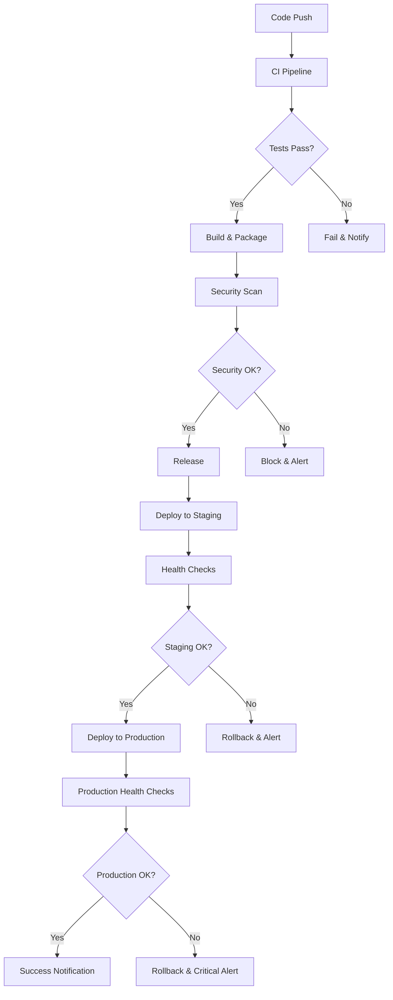

# GitHub Actions CI/CD Pipeline

This directory contains the complete CI/CD pipeline configuration for the Imaginarium monorepo, implementing modern DevOps practices with automated testing, security scanning, semantic versioning, and multi-environment deployments.

## 📋 Table of Contents

- [Workflows Overview](#workflows-overview)
- [Workflow Triggers](#workflow-triggers)
- [Environment Configuration](#environment-configuration)
- [Security & Secrets](#security--secrets)
- [Deployment Strategies](#deployment-strategies)
- [Monitoring & Health Checks](#monitoring--health-checks)
- [Contributing](#contributing)

## 🔄 Workflows Overview

### Core Workflows

#### 1. **CI Pipeline** (`ci.yml`)
**Purpose:** Continuous Integration for all code changes
- **Triggers:** Push to `main`/`develop`, Pull Requests
- **Features:**
  - Monorepo change detection with path filtering
  - Parallel job execution for optimal performance
  - Multi-stage validation (lint, typecheck, build, test)
  - PostgreSQL and Redis service containers
  - Docker image building and validation
  - Security scanning with Trivy
  - Code coverage reporting with Codecov
  - Quality gates with comprehensive validation

#### 2. **Pull Request Workflow** (`pr.yml`)
**Purpose:** Enhanced PR validation and automation
- **Triggers:** PR opened, synchronized, reopened
- **Features:**
  - Conventional commit validation for PR titles
  - Bundle size analysis and reporting
  - Dependency duplication checking
  - Visual regression testing (when applicable)
  - Performance testing for critical changes
  - Code complexity analysis
  - Auto-reviewer assignment based on changed files
  - Automatic labeling by file patterns
  - Coverage threshold enforcement

#### 3. **Release Pipeline** (`release.yml`)
**Purpose:** Automated semantic versioning and releases
- **Triggers:** Push to release branches (`main`, `next`, `beta`, `alpha`)
- **Features:**
  - Semantic release with conventional commits
  - Automated changelog generation
  - Multi-stage Docker image publishing to GHCR
  - Automatic version bumping across monorepo
  - GitHub release creation with artifacts
  - Deployment to staging and production environments
  - Slack notifications for release status

#### 4. **Deployment Workflow** (`deploy.yml`)
**Purpose:** Manual deployment to specific environments
- **Triggers:** Manual dispatch with environment selection
- **Features:**
  - Environment-specific configuration
  - Health checks post-deployment
  - Smoke tests for critical functionality
  - Rollback capabilities
  - Deployment status tracking
  - Notification system

### Security & Maintenance Workflows

#### 5. **Security Scanning** (`security.yml`)
**Purpose:** Comprehensive security assessment
- **Triggers:** Daily schedule, manual dispatch, security-related changes
- **Features:**
  - Dependency vulnerability scanning (npm audit)
  - Container security scanning (Trivy)
  - Static code analysis (CodeQL)
  - Secret scanning (TruffleHog)
  - License compliance checking
  - OWASP dependency checking
  - Security report aggregation
  - Critical alert system

#### 6. **Dependency Updates** (`dependency-update.yml`)
**Purpose:** Automated dependency management
- **Triggers:** Weekly schedule, manual dispatch
- **Features:**
  - Weekly dependency updates with npm-check-updates
  - Security vulnerability patching
  - Automated testing of dependency updates
  - Smart PR creation with detailed changelogs
  - Dependabot auto-merge for minor/patch updates
  - Major version update flagging for review

#### 7. **Monitoring & Health Checks** (`monitoring.yml`)
**Purpose:** Continuous system monitoring
- **Triggers:** Every 15 minutes, manual dispatch
- **Features:**
  - Multi-environment health endpoint monitoring
  - Performance metrics collection
  - SSL certificate expiry monitoring
  - Database connectivity checks
  - Response time analysis
  - Critical alerting system
  - Metrics reporting and trending

## 🎯 Workflow Triggers

### Automated Triggers

| Workflow | Schedule | Events | Branches |
|----------|----------|--------|----------|
| CI | - | Push, PR | `main`, `develop` |
| PR | - | PR lifecycle | All branches |
| Release | - | Push | `main`, `next`, `beta`, `alpha` |
| Security | Daily 2 AM | Push (security files) | `main`, `develop` |
| Dependencies | Weekly Monday 8 AM | - | - |
| Monitoring | Every 15 minutes | - | - |

### Manual Triggers

All workflows support manual dispatch (`workflow_dispatch`) for debugging and emergency operations.

## 🌍 Environment Configuration

### Environment Strategy

1. **Development** - Feature development and testing
2. **Staging** - Pre-production validation
3. **Production** - Live user-facing environment

### Environment-Specific Settings

```yaml
# Development
namespace: imaginarium-dev
replicas: 1
resources:
  cpu: 200m
  memory: 256Mi

# Staging  
namespace: imaginarium-staging
replicas: 2
resources:
  cpu: 500m
  memory: 512Mi

# Production
namespace: imaginarium-prod
replicas: 3
resources:
  cpu: 1000m
  memory: 1Gi
```

## 🔒 Security & Secrets

### Required Secrets

Configure these secrets in GitHub repository settings:

#### Core Secrets
- `GITHUB_TOKEN` - Automatic (GitHub provides)
- `NPM_TOKEN` - For package publishing
- `SLACK_WEBHOOK_URL` - Slack notifications

#### Deployment Secrets
- `KUBE_CONFIG` - Kubernetes cluster access
- `REGISTRY_TOKEN` - Container registry access
- `SSH_PRIVATE_KEY` - Server access for deployments

#### Monitoring Secrets
- `SENTRY_DSN` - Error tracking
- `DATADOG_API_KEY` - Metrics and monitoring

### Security Scanning

- **Vulnerability Scanning:** Daily Trivy scans for containers
- **Dependency Scanning:** npm audit with automated fixing
- **Code Analysis:** CodeQL for static security analysis
- **Secret Detection:** TruffleHog for exposed secrets
- **License Compliance:** Automated license validation

## 🚀 Deployment Strategies

### Deployment Flow



### Deployment Strategies by Environment

#### Staging Deployment
- **Strategy:** Blue-Green
- **Triggers:** Automatic on release
- **Validation:** Full test suite + smoke tests
- **Rollback:** Automatic on health check failure

#### Production Deployment
- **Strategy:** Rolling deployment with canary
- **Triggers:** Manual approval after staging validation
- **Validation:** Comprehensive health checks + monitoring
- **Rollback:** Manual or automatic based on metrics

## 📊 Monitoring & Health Checks

### Health Check Endpoints

- **API Health:** `/api/health`
- **Database:** `/api/health/database`
- **Redis:** `/api/health/redis`
- **Version:** `/api/version`

### Monitoring Metrics

#### Performance Metrics
- Response time (< 3s production, < 5s staging)
- Error rate (< 1% production, < 5% staging)
- Throughput (requests per second)
- Resource utilization (CPU, memory, disk)

#### Availability Metrics
- Uptime percentage
- Service availability
- Database connectivity
- External service dependencies

### Alert Thresholds

#### Critical Alerts (Immediate Action)
- Service down (health check failures)
- Error rate > 5%
- Response time > 10s
- SSL certificate expiry < 7 days

#### Warning Alerts (Action Required)
- Performance degradation (response time > 3s)
- High resource usage (> 80%)
- SSL certificate expiry < 30 days
- Security vulnerabilities detected

## 🔧 Configuration Files

### Supporting Configuration

- **`.releaserc.json`** - Semantic release configuration
- **`auto-assign.yml`** - Automatic reviewer assignment
- **`labeler.yml`** - Automatic PR labeling
- **`dependabot.yml`** - Dependency update configuration

### Workflow Customization

To customize workflows for your environment:

1. Update environment URLs in workflow files
2. Configure secrets in repository settings
3. Adjust monitoring thresholds as needed
4. Modify deployment strategies based on infrastructure
5. Update notification channels (Slack, email, etc.)

## 📈 Metrics & Reporting

### Build Metrics
- Build success rate
- Build duration trends
- Test coverage trends
- Security scan results

### Deployment Metrics
- Deployment frequency
- Lead time for changes
- Mean time to recovery
- Change failure rate

### Quality Metrics
- Code coverage percentage
- Security vulnerability count
- Dependency update frequency
- License compliance status

## 🤝 Contributing

### Workflow Development

1. Test workflow changes in a feature branch
2. Use `workflow_dispatch` for manual testing
3. Monitor workflow runs and performance
4. Update documentation for any changes

### Adding New Environments

1. Create environment-specific configuration
2. Add secrets for new environment
3. Update deployment workflows
4. Configure monitoring endpoints
5. Test deployment process

### Best Practices

- Keep workflows focused and modular
- Use meaningful job and step names
- Implement proper error handling
- Add comprehensive logging
- Monitor workflow performance
- Regularly review and optimize

## 📞 Support & Troubleshooting

### Common Issues

1. **Build Failures**
   - Check dependency compatibility
   - Verify test environment setup
   - Review error logs in workflow runs

2. **Deployment Issues**
   - Validate environment configuration
   - Check secret configuration
   - Verify health check endpoints

3. **Security Scan Failures**
   - Review vulnerability reports
   - Update dependencies as needed
   - Check license compliance

### Getting Help

- Review workflow run logs in GitHub Actions
- Check repository Issues for known problems
- Consult team documentation and runbooks
- Contact DevOps team for infrastructure issues

---

This CI/CD pipeline provides a robust foundation for modern software delivery with emphasis on quality, security, and reliability. Regular review and optimization ensure continued effectiveness as the project evolves.