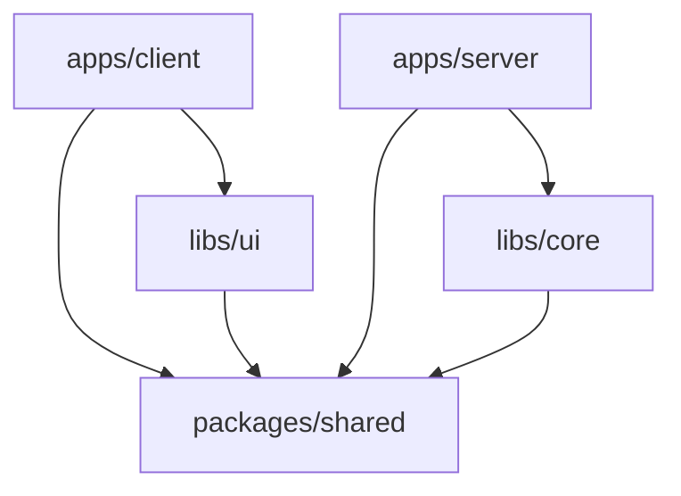

# 🎭 Imaginarium

> AI-powered content generation pipeline automation platform

Imaginarium is a comprehensive platform for building, managing, and orchestrating AI content generation pipelines. Built with a modern TypeScript monorepo architecture, it provides a visual pipeline builder, robust backend processing, and real-time collaboration features.

## 🚀 Quick Start

### Prerequisites

- **Node.js** >= 18.0.0
- **npm** >= 9.0.0
- **Docker** (optional, for containerized development)

### Installation

```bash
# Clone the repository
git clone https://github.com/your-org/imaginarium.git
cd imaginarium

# Install dependencies for all packages
npm install

# Build shared libraries
npm run build:libs

# Start development servers
npm run dev
```

This will start:
- **Client** (React app): `http://localhost:5173`
- **Server** (Express API): `http://localhost:3000`

### Docker Development

```bash
# Start all services with Docker
npm run docker:dev

# View logs
npm run docker:dev:logs

# Stop services
npm run docker:dev:stop
```

## 📦 Project Structure

```
imaginarium/
├── apps/
│   ├── client/          # React frontend (Vite + TypeScript)
│   └── server/          # Express backend API
├── packages/
│   └── shared/          # Shared types, schemas, and utilities
├── libs/
│   ├── core/           # Core pipeline engine and node system
│   └── ui/             # Reusable UI components library
├── configs/            # Shared ESLint/Prettier configurations
├── docker/             # Docker configurations and scripts
└── scripts/            # Development and deployment scripts
```

### Package Dependencies



## 🏗️ Architecture

### Frontend Stack
- **React 18** with TypeScript
- **Vite** for build tooling and dev server
- **Tailwind CSS** + **Ant Design** for styling
- **Zustand** for state management
- **React Router** for navigation
- **React Flow** for pipeline visualization
- **Socket.io** for real-time updates

### Backend Stack
- **Express.js** with TypeScript
- **SQLite** with **Drizzle ORM** for database
- **Redis** with **Bull** for job queues
- **Socket.io** for real-time communication
- **Winston** for logging
- **JWT** for authentication
- **OpenAI API** integration

### Development Tools
- **TypeScript** with project references
- **ESLint** + **Prettier** for code quality
- **Vitest** for testing
- **Husky** for git hooks
- **Semantic Release** for automated versioning
- **Docker** for containerization

## 🛠️ Development

### Available Scripts

#### Root Level Commands
```bash
# Development
npm run dev              # Start all dev servers
npm run dev:client       # Start only client
npm run dev:server       # Start only server

# Building
npm run build           # Build all packages
npm run build:libs      # Build shared libraries only
npm run build:apps      # Build applications only

# Testing
npm run test            # Run all tests
npm run test:coverage   # Run tests with coverage
npm run test:watch      # Run tests in watch mode

# Code Quality
npm run lint            # Lint all packages
npm run format          # Format all code
npm run typecheck       # Type check all packages

# Workspace Management
npm run clean           # Clean all build artifacts
```

#### Package-Specific Commands
```bash
# Test specific packages
npm run test:client
npm run test:server
npm run test:shared
npm run test:core
npm run test:ui

# Build specific packages
npm run build:client
npm run build:server
```

### Adding New Packages

1. Create package directory in appropriate folder (`apps/`, `packages/`, or `libs/`)
2. Add package.json with proper workspace configuration
3. Update root package.json scripts if needed
4. Configure TypeScript project references in tsconfig.json

### Code Style

The project uses strict TypeScript configuration with comprehensive ESLint rules:

- **Strict mode** enabled with additional checks
- **Unused variables/parameters** not allowed
- **Consistent casing** enforced
- **React hooks** rules for frontend packages
- **Accessibility** rules for UI components

### Testing Strategy

- **Unit tests** for individual functions and components
- **Integration tests** for API endpoints and workflows
- **Component tests** for React components with Testing Library
- **E2E tests** planned for critical user flows

### Git Workflow

The project uses **Conventional Commits** with automated semantic versioning:

```bash
# Commit format
git commit -m "feat: add pipeline node validation"
git commit -m "fix: resolve authentication token refresh"
git commit -m "docs: update API documentation"
```

**Pre-commit hooks** automatically:
- Lint and format code
- Run affected tests
- Validate commit messages

## 🐳 Docker

### Development Environment

```bash
# Full development stack
docker-compose up

# Individual services
docker-compose up client
docker-compose up server
```

Services include:
- **Client** (React dev server)
- **Server** (Express API)
- **PostgreSQL** database
- **Redis** cache and queues
- **Nginx** reverse proxy

### Production Deployment

```bash
# Build production images
npm run docker:prod

# Deploy to production
npm run docker:prod:deploy
```

## 🔧 Configuration

### Environment Variables

Create `.env` file in the root directory:

```env
# Database
DATABASE_URL=sqlite:./data/imaginarium.db

# Redis
REDIS_URL=redis://localhost:6379

# Authentication
JWT_SECRET=your-secret-key
JWT_EXPIRES_IN=7d

# OpenAI
OPENAI_API_KEY=your-openai-key

# Server
PORT=3000
NODE_ENV=development

# Client
VITE_API_URL=http://localhost:3000
```

### TypeScript Configuration

The project uses **TypeScript project references** for efficient builds:

- **Root config** (`tsconfig.json`): Base configuration
- **Build config** (`tsconfig.build.json`): Production builds
- **Package configs**: Individual package overrides

### Monorepo Workspace

npm workspaces configuration enables:
- **Shared dependencies** across packages
- **Cross-package imports** with path mapping
- **Unified scripts** execution
- **Hoisted node_modules** for efficiency

## 📚 API Documentation

### Authentication Endpoints
```
POST /api/auth/login      # User login
POST /api/auth/register   # User registration
POST /api/auth/refresh    # Token refresh
```

### Pipeline Endpoints
```
GET    /api/pipelines         # List pipelines
POST   /api/pipelines         # Create pipeline
GET    /api/pipelines/:id     # Get pipeline
PUT    /api/pipelines/:id     # Update pipeline
DELETE /api/pipelines/:id     # Delete pipeline
POST   /api/pipelines/:id/run # Execute pipeline
```

### WebSocket Events
```
pipeline:created    # New pipeline created
pipeline:updated    # Pipeline modified
pipeline:executed   # Pipeline execution started
job:progress        # Job progress updates
job:completed       # Job finished
job:failed          # Job error
```

## 🤝 Contributing

1. **Fork** the repository
2. **Create** a feature branch: `git checkout -b feature/amazing-feature`
3. **Commit** changes: `git commit -m 'feat: add amazing feature'`
4. **Push** to branch: `git push origin feature/amazing-feature`
5. **Open** a Pull Request

See [CONTRIBUTING.md](CONTRIBUTING.md) for detailed guidelines.

## 📄 License

This project is licensed under the MIT License - see the [LICENSE](LICENSE) file for details.

## 🙏 Acknowledgments

- **React Flow** for pipeline visualization
- **Ant Design** for UI components
- **Drizzle ORM** for type-safe database access
- **Vite** for fast development builds

---

**Built with ❤️ by the Imaginarium Team**
