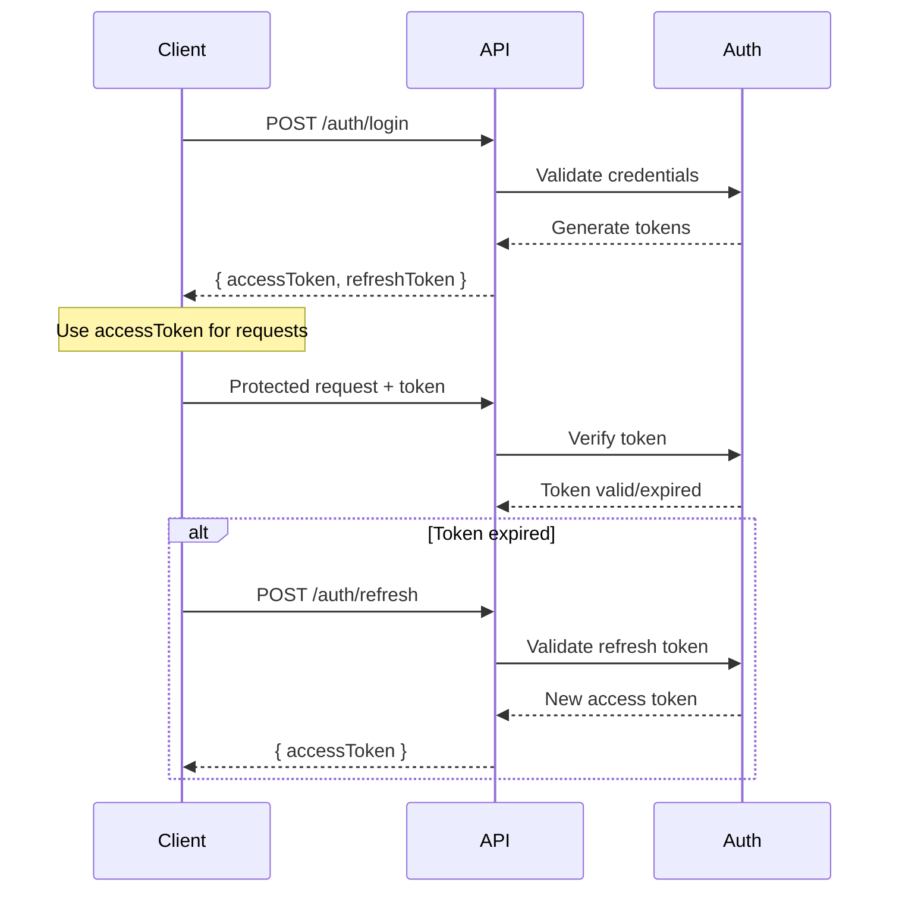

# Imaginarium API Documentation

This document provides comprehensive API documentation for the Imaginarium platform, including REST endpoints, WebSocket events, and authentication.

## 📡 Base URL

- **Development**: `http://localhost:3000`
- **Production**: `https://api.imaginarium.example.com`

## 🔐 Authentication

### JWT Authentication

All protected endpoints require a valid JWT token in the Authorization header:

```http
Authorization: Bearer <jwt_token>
```

### Token Lifecycle



## 🔑 Authentication Endpoints

### POST /auth/login

Authenticate user and receive JWT tokens.

**Request Body:**
```json
{
  "email": "user@example.com",
  "password": "securePassword123"
}
```

**Response (200):**
```json
{
  "user": {
    "id": "user_123",
    "email": "user@example.com",
    "role": "editor",
    "createdAt": "2024-01-15T10:00:00Z"
  },
  "accessToken": "eyJhbGciOiJIUzI1NiIsInR5cCI6IkpXVCJ9...",
  "refreshToken": "eyJhbGciOiJIUzI1NiIsInR5cCI6IkpXVCJ9..."
}
```

**Error Responses:**
- `400 Bad Request` - Invalid request body
- `401 Unauthorized` - Invalid credentials
- `429 Too Many Requests` - Rate limit exceeded

---

### POST /auth/register

Create a new user account.

**Request Body:**
```json
{
  "email": "newuser@example.com",
  "password": "securePassword123",
  "confirmPassword": "securePassword123"
}
```

**Response (201):**
```json
{
  "user": {
    "id": "user_124",
    "email": "newuser@example.com",
    "role": "viewer",
    "createdAt": "2024-01-15T10:30:00Z"
  },
  "accessToken": "eyJhbGciOiJIUzI1NiIsInR5cCI6IkpXVCJ9...",
  "refreshToken": "eyJhbGciOiJIUzI1NiIsInR5cCI6IkpXVCJ9..."
}
```

---

### POST /auth/refresh

Refresh an expired access token.

**Request Body:**
```json
{
  "refreshToken": "eyJhbGciOiJIUzI1NiIsInR5cCI6IkpXVCJ9..."
}
```

**Response (200):**
```json
{
  "accessToken": "eyJhbGciOiJIUzI1NiIsInR5cCI6IkpXVCJ9...",
  "expiresIn": 3600
}
```

---

### POST /auth/logout

Invalidate refresh token and logout user.

**Headers:** `Authorization: Bearer <token>`

**Response (200):**
```json
{
  "message": "Successfully logged out"
}
```

## 🔧 Pipeline Management

### GET /api/pipelines

Retrieve user's pipelines with optional filtering and pagination.

**Headers:** `Authorization: Bearer <token>`

**Query Parameters:**
- `page` (number, default: 1) - Page number
- `limit` (number, default: 20, max: 100) - Items per page
- `search` (string) - Search by pipeline name
- `status` (string) - Filter by status: `draft`, `published`, `archived`
- `sortBy` (string) - Sort field: `name`, `createdAt`, `updatedAt`
- `sortOrder` (string) - Sort direction: `asc`, `desc`

**Response (200):**
```json
{
  "pipelines": [
    {
      "id": "pipeline_123",
      "name": "Content Generation Pipeline",
      "description": "Automated blog post generation with AI",
      "status": "published",
      "metadata": {
        "tags": ["ai", "content", "automation"],
        "category": "content-generation"
      },
      "nodeCount": 5,
      "lastExecuted": "2024-01-15T09:30:00Z",
      "createdAt": "2024-01-10T14:00:00Z",
      "updatedAt": "2024-01-15T08:00:00Z"
    }
  ],
  "pagination": {
    "page": 1,
    "limit": 20,
    "total": 45,
    "totalPages": 3
  }
}
```

---

### POST /api/pipelines

Create a new pipeline.

**Headers:** `Authorization: Bearer <token>`

**Request Body:**
```json
{
  "name": "My New Pipeline",
  "description": "Pipeline description",
  "metadata": {
    "tags": ["ai", "automation"],
    "category": "data-processing"
  },
  "nodes": [
    {
      "id": "node_1",
      "type": "input",
      "position": { "x": 100, "y": 100 },
      "config": {
        "inputType": "text",
        "placeholder": "Enter your prompt"
      }
    },
    {
      "id": "node_2", 
      "type": "openai",
      "position": { "x": 300, "y": 100 },
      "config": {
        "model": "gpt-4",
        "maxTokens": 2048,
        "temperature": 0.7
      }
    }
  ],
  "connections": [
    {
      "source": "node_1",
      "target": "node_2",
      "sourceHandle": "output",
      "targetHandle": "input"
    }
  ]
}
```

**Response (201):**
```json
{
  "id": "pipeline_125",
  "name": "My New Pipeline",
  "description": "Pipeline description",
  "status": "draft",
  "metadata": {
    "tags": ["ai", "automation"],
    "category": "data-processing"
  },
  "nodes": [...],
  "connections": [...],
  "createdAt": "2024-01-15T11:00:00Z",
  "updatedAt": "2024-01-15T11:00:00Z"
}
```

---

### GET /api/pipelines/:id

Retrieve a specific pipeline with full details.

**Headers:** `Authorization: Bearer <token>`

**Path Parameters:**
- `id` (string) - Pipeline ID

**Response (200):**
```json
{
  "id": "pipeline_123",
  "name": "Content Generation Pipeline",
  "description": "Automated blog post generation with AI",
  "status": "published",
  "metadata": {
    "tags": ["ai", "content", "automation"],
    "category": "content-generation"
  },
  "nodes": [
    {
      "id": "node_1",
      "type": "input",
      "position": { "x": 100, "y": 100 },
      "config": {
        "inputType": "text",
        "placeholder": "Enter topic"
      }
    },
    {
      "id": "node_2",
      "type": "openai",
      "position": { "x": 300, "y": 100 },
      "config": {
        "model": "gpt-4",
        "maxTokens": 2048,
        "temperature": 0.7,
        "systemPrompt": "You are a professional content writer..."
      }
    }
  ],
  "connections": [
    {
      "id": "conn_1",
      "source": "node_1",
      "target": "node_2",
      "sourceHandle": "output",
      "targetHandle": "input"
    }
  ],
  "executions": [
    {
      "id": "exec_456",
      "status": "completed",
      "startedAt": "2024-01-15T09:30:00Z",
      "completedAt": "2024-01-15T09:32:15Z",
      "duration": 135000
    }
  ],
  "createdAt": "2024-01-10T14:00:00Z",
  "updatedAt": "2024-01-15T08:00:00Z"
}
```

---

### PUT /api/pipelines/:id

Update an existing pipeline.

**Headers:** `Authorization: Bearer <token>`

**Path Parameters:**
- `id` (string) - Pipeline ID

**Request Body:** (Same structure as POST /api/pipelines)

**Response (200):** (Same structure as GET /api/pipelines/:id)

---

### DELETE /api/pipelines/:id

Delete a pipeline.

**Headers:** `Authorization: Bearer <token>`

**Path Parameters:**
- `id` (string) - Pipeline ID

**Response (204):** No content

---

### POST /api/pipelines/:id/run

Execute a pipeline with provided inputs.

**Headers:** `Authorization: Bearer <token>`

**Path Parameters:**
- `id` (string) - Pipeline ID

**Request Body:**
```json
{
  "inputs": {
    "node_1": {
      "text": "Write about sustainable energy"
    }
  },
  "config": {
    "async": true,
    "webhookUrl": "https://example.com/webhook"
  }
}
```

**Response (202):** (Async execution)
```json
{
  "executionId": "exec_789",
  "status": "queued",
  "estimatedDuration": 120,
  "queuePosition": 3,
  "webhookUrl": "https://example.com/webhook"
}
```

**Response (200):** (Sync execution)
```json
{
  "executionId": "exec_790",
  "status": "completed",
  "results": {
    "node_2": {
      "text": "# Sustainable Energy: A Path Forward\n\nSustainable energy..."
    }
  },
  "duration": 45000,
  "completedAt": "2024-01-15T11:05:45Z"
}
```

## 📊 Execution Management

### GET /api/executions

Retrieve execution history.

**Headers:** `Authorization: Bearer <token>`

**Query Parameters:**
- `pipelineId` (string) - Filter by pipeline
- `status` (string) - Filter by status: `queued`, `running`, `completed`, `failed`
- `page` (number, default: 1)
- `limit` (number, default: 20)

**Response (200):**
```json
{
  "executions": [
    {
      "id": "exec_789",
      "pipelineId": "pipeline_123",
      "pipelineName": "Content Generation Pipeline",
      "status": "completed",
      "startedAt": "2024-01-15T11:00:00Z",
      "completedAt": "2024-01-15T11:02:30Z",
      "duration": 150000,
      "nodeExecutions": 3,
      "tokensUsed": 1500,
      "cost": 0.045
    }
  ],
  "pagination": {
    "page": 1,
    "limit": 20,
    "total": 127,
    "totalPages": 7
  }
}
```

---

### GET /api/executions/:id

Get detailed execution results.

**Headers:** `Authorization: Bearer <token>`

**Path Parameters:**
- `id` (string) - Execution ID

**Response (200):**
```json
{
  "id": "exec_789",
  "pipelineId": "pipeline_123",
  "status": "completed",
  "inputs": {
    "node_1": {
      "text": "Write about sustainable energy"
    }
  },
  "results": {
    "node_2": {
      "text": "# Sustainable Energy: A Path Forward...",
      "metadata": {
        "model": "gpt-4",
        "tokensUsed": 1500,
        "cost": 0.045
      }
    }
  },
  "logs": [
    {
      "timestamp": "2024-01-15T11:00:00Z",
      "level": "info",
      "message": "Execution started",
      "nodeId": null
    },
    {
      "timestamp": "2024-01-15T11:00:05Z",
      "level": "info", 
      "message": "Processing node: Input",
      "nodeId": "node_1"
    },
    {
      "timestamp": "2024-01-15T11:02:30Z",
      "level": "info",
      "message": "Execution completed successfully",
      "nodeId": null
    }
  ],
  "metrics": {
    "duration": 150000,
    "nodeExecutions": 3,
    "tokensUsed": 1500,
    "cost": 0.045
  },
  "startedAt": "2024-01-15T11:00:00Z",
  "completedAt": "2024-01-15T11:02:30Z"
}
```

## 👤 User Management

### GET /api/users/profile

Get current user profile.

**Headers:** `Authorization: Bearer <token>`

**Response (200):**
```json
{
  "id": "user_123",
  "email": "user@example.com",
  "role": "editor",
  "preferences": {
    "theme": "dark",
    "notifications": {
      "email": true,
      "browser": true
    },
    "defaultModel": "gpt-4"
  },
  "usage": {
    "pipelinesCreated": 15,
    "executionsThisMonth": 245,
    "tokensUsedThisMonth": 125000
  },
  "createdAt": "2024-01-01T10:00:00Z",
  "lastLoginAt": "2024-01-15T09:00:00Z"
}
```

---

### PUT /api/users/profile

Update user profile.

**Headers:** `Authorization: Bearer <token>`

**Request Body:**
```json
{
  "preferences": {
    "theme": "light",
    "notifications": {
      "email": false,
      "browser": true
    },
    "defaultModel": "gpt-3.5-turbo"
  }
}
```

**Response (200):** (Same structure as GET /api/users/profile)

## 🌐 WebSocket Events

### Connection

Connect to WebSocket server with authentication:

```javascript
const socket = io('http://localhost:3000', {
  auth: {
    token: 'Bearer <jwt_token>'
  }
});
```

### Event Categories

#### Pipeline Events

**`pipeline:created`**
```json
{
  "type": "pipeline:created",
  "data": {
    "id": "pipeline_125",
    "name": "New Pipeline",
    "userId": "user_123"
  }
}
```

**`pipeline:updated`**
```json
{
  "type": "pipeline:updated", 
  "data": {
    "id": "pipeline_123",
    "changes": ["nodes", "connections"],
    "updatedBy": "user_456"
  }
}
```

**`pipeline:deleted`**
```json
{
  "type": "pipeline:deleted",
  "data": {
    "id": "pipeline_123",
    "deletedBy": "user_123"
  }
}
```

#### Execution Events

**`execution:started`**
```json
{
  "type": "execution:started",
  "data": {
    "id": "exec_789",
    "pipelineId": "pipeline_123",
    "startedAt": "2024-01-15T11:00:00Z"
  }
}
```

**`execution:progress`**
```json
{
  "type": "execution:progress",
  "data": {
    "id": "exec_789",
    "nodeId": "node_2",
    "status": "running",
    "progress": 0.65,
    "message": "Processing with OpenAI..."
  }
}
```

**`execution:completed`**
```json
{
  "type": "execution:completed",
  "data": {
    "id": "exec_789",
    "status": "completed",
    "duration": 150000,
    "completedAt": "2024-01-15T11:02:30Z"
  }
}
```

**`execution:failed`**
```json
{
  "type": "execution:failed",
  "data": {
    "id": "exec_789",
    "error": {
      "code": "OPENAI_API_ERROR",
      "message": "API rate limit exceeded",
      "nodeId": "node_2"
    },
    "failedAt": "2024-01-15T11:01:00Z"
  }
}
```

#### Collaboration Events

**`user:joined`**
```json
{
  "type": "user:joined",
  "data": {
    "userId": "user_456",
    "pipelineId": "pipeline_123",
    "userName": "John Doe"
  }
}
```

**`user:left`**
```json
{
  "type": "user:left",
  "data": {
    "userId": "user_456",
    "pipelineId": "pipeline_123"
  }
}
```

### Client-Side Implementation

```typescript
// TypeScript WebSocket client example
import { io, Socket } from 'socket.io-client';

interface ServerToClientEvents {
  'pipeline:created': (data: PipelineCreatedEvent) => void;
  'pipeline:updated': (data: PipelineUpdatedEvent) => void;
  'execution:progress': (data: ExecutionProgressEvent) => void;
  'execution:completed': (data: ExecutionCompletedEvent) => void;
}

interface ClientToServerEvents {
  'join:pipeline': (pipelineId: string) => void;
  'leave:pipeline': (pipelineId: string) => void;
}

const socket: Socket<ServerToClientEvents, ClientToServerEvents> = io('http://localhost:3000', {
  auth: {
    token: `Bearer ${accessToken}`
  }
});

// Join pipeline room for real-time updates
socket.emit('join:pipeline', 'pipeline_123');

// Listen for execution progress
socket.on('execution:progress', (data) => {
  updateExecutionProgress(data.id, data.progress);
});

// Listen for pipeline updates from other users
socket.on('pipeline:updated', (data) => {
  if (data.updatedBy !== currentUserId) {
    showCollaborationNotification(`Pipeline updated by ${data.updatedBy}`);
    refreshPipelineData(data.id);
  }
});
```

## 📋 Error Handling

### Standard Error Response Format

```json
{
  "error": {
    "code": "VALIDATION_ERROR",
    "message": "Request validation failed",
    "details": [
      {
        "field": "email",
        "message": "Invalid email format"
      },
      {
        "field": "password",
        "message": "Password must be at least 8 characters"
      }
    ],
    "requestId": "req_abc123",
    "timestamp": "2024-01-15T11:30:00Z"
  }
}
```

### Error Codes

| Code | HTTP Status | Description |
|------|-------------|-------------|
| `VALIDATION_ERROR` | 400 | Request validation failed |
| `UNAUTHORIZED` | 401 | Authentication required |
| `FORBIDDEN` | 403 | Insufficient permissions |
| `NOT_FOUND` | 404 | Resource not found |
| `CONFLICT` | 409 | Resource already exists |
| `RATE_LIMIT_EXCEEDED` | 429 | Too many requests |
| `INTERNAL_ERROR` | 500 | Server error |
| `SERVICE_UNAVAILABLE` | 503 | Service temporarily unavailable |
| `PIPELINE_EXECUTION_FAILED` | 422 | Pipeline execution error |
| `OPENAI_API_ERROR` | 502 | External API error |

## 📈 Rate Limiting

### Limits by Endpoint Category

| Category | Requests per Minute | Burst Limit |
|----------|-------------------|-------------|
| Authentication | 5 | 10 |
| Pipeline CRUD | 60 | 100 |
| Pipeline Execution | 10 | 20 |
| User Profile | 30 | 50 |
| General API | 120 | 200 |

### Rate Limit Headers

```http
X-RateLimit-Limit: 60
X-RateLimit-Remaining: 45
X-RateLimit-Reset: 1642248000
Retry-After: 15
```

## 🔧 API Versioning

### Version Strategy

- Current version: `v1`
- API versioning via URL path: `/api/v1/...`
- Backward compatibility maintained for 12 months
- Deprecation warnings via `Deprecation` header

### Migration Guides

When breaking changes are introduced, migration guides will be provided at:
- `/docs/api/migrations/v1-to-v2.md`
- `/docs/api/migrations/v2-to-v3.md`

---

For implementation examples and SDK usage, see the [examples directory](../examples/) in the repository.