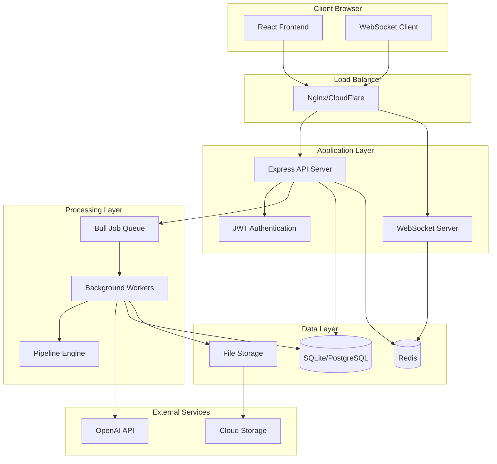
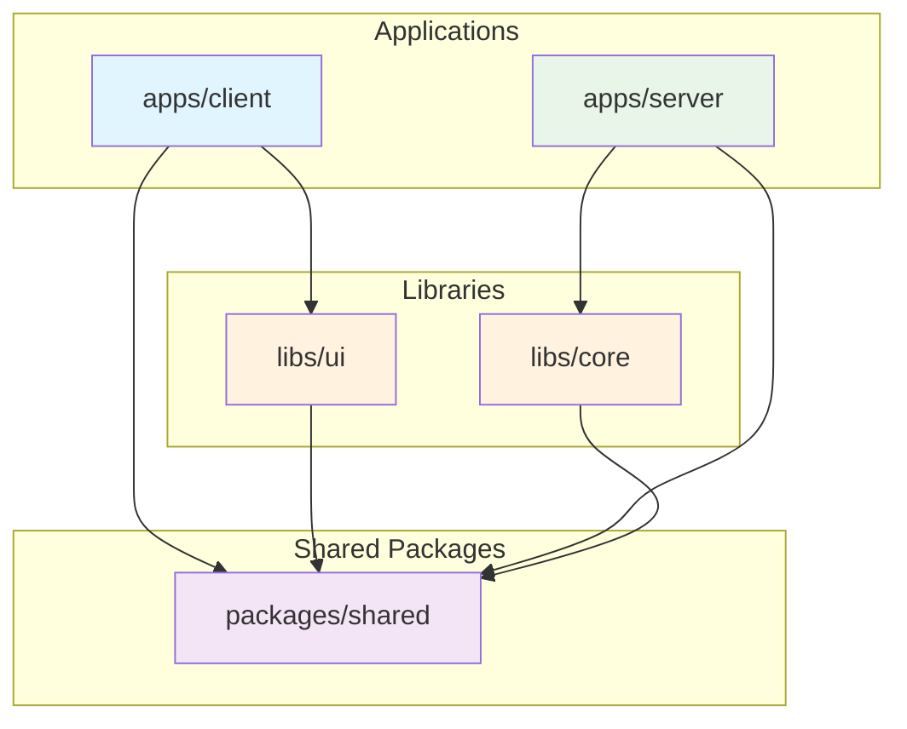
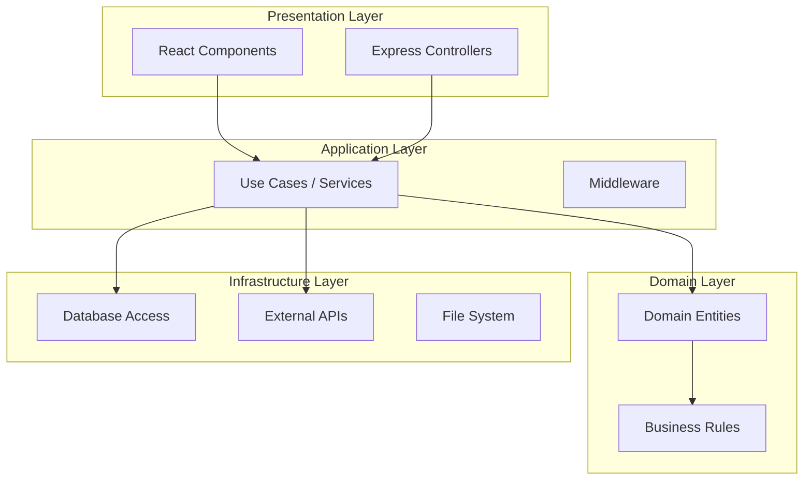
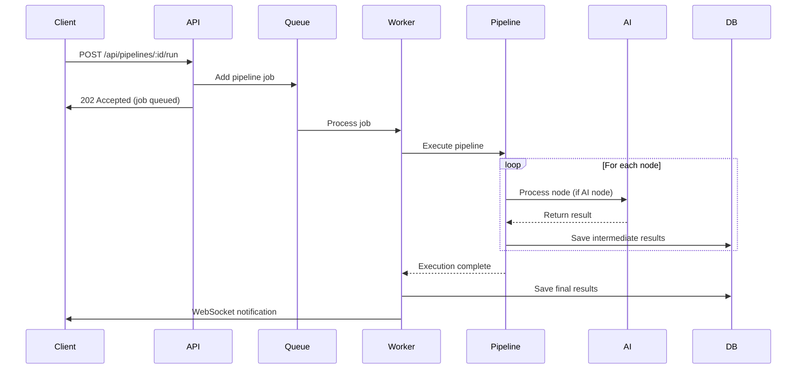
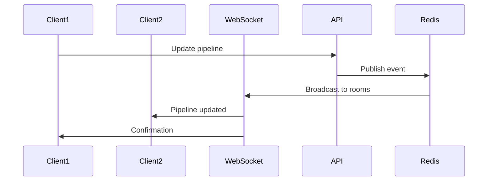
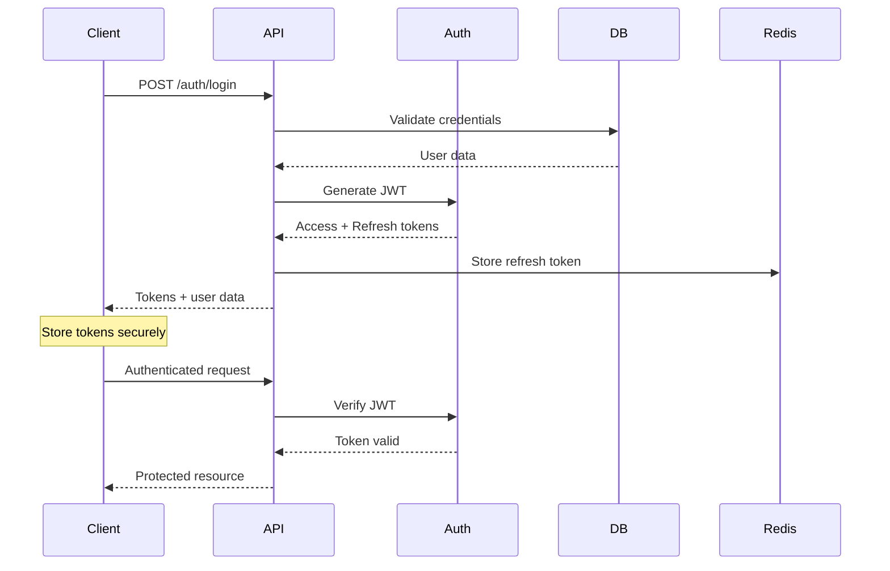
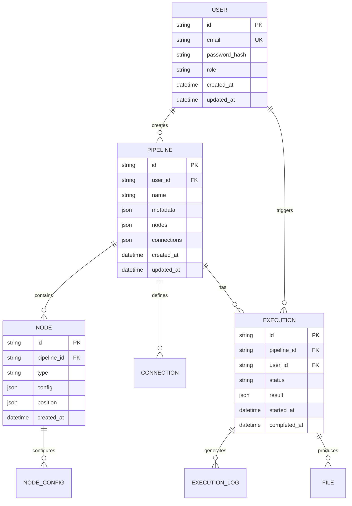
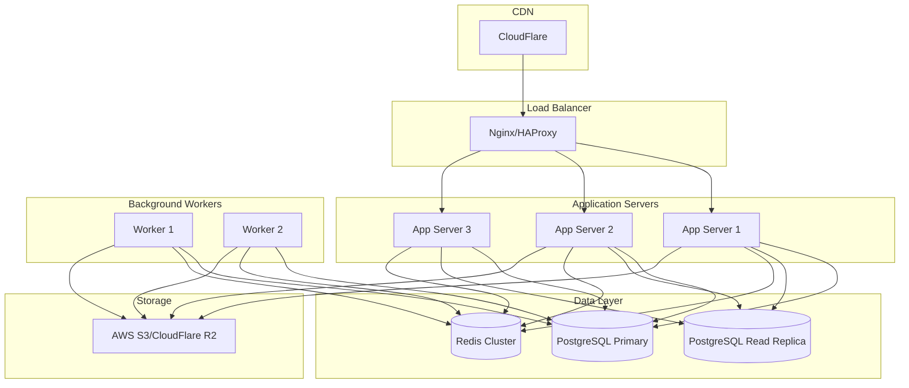

# Imaginarium Architecture

This document provides a comprehensive overview of the Imaginarium platform architecture, including system design, package relationships, data flow, and technical decisions.

## 🏗️ System Overview

Imaginarium is built as a modern TypeScript monorepo with a modular architecture that separates concerns across multiple packages while enabling efficient development and deployment workflows.

### High-Level Architecture



## 📦 Monorepo Structure

### Package Organization

```
imaginarium/
├── apps/                    # Applications (deployable artifacts)
│   ├── client/             # React frontend application
│   └── server/             # Express backend API
├── packages/               # Shared business logic packages
│   └── shared/             # Types, schemas, utilities
├── libs/                   # Reusable library packages
│   ├── core/              # Pipeline engine and business logic
│   └── ui/                # React UI component library
├── configs/               # Shared configuration files
├── docker/                # Docker configurations
├── scripts/               # Build and deployment scripts
└── docs/                  # Architecture and API documentation
```

### Package Dependency Graph



### Package Descriptions

| Package | Purpose | Dependencies | Exports |
|---------|---------|--------------|---------|
| `apps/client` | React frontend SPA | `libs/ui`, `packages/shared` | Built web application |
| `apps/server` | Express API server | `libs/core`, `packages/shared` | REST API & WebSocket server |
| `libs/ui` | UI component library | `packages/shared` | React components, hooks |
| `libs/core` | Pipeline engine | `packages/shared` | Pipeline execution, validation |
| `packages/shared` | Common utilities | None | Types, schemas, utilities |

## 🔧 Technical Stack

### Frontend Technologies

```typescript
// Technology stack for apps/client
{
  "framework": "React 18",
  "buildTool": "Vite",
  "styling": ["Tailwind CSS", "Ant Design"],
  "stateManagement": "Zustand",
  "routing": "React Router",
  "visualization": "React Flow",
  "realtime": "Socket.io Client",
  "forms": "React Hook Form + Zod",
  "testing": "Vitest + Testing Library",
  "typeChecking": "TypeScript 5.3"
}
```

### Backend Technologies

```typescript
// Technology stack for apps/server
{
  "framework": "Express.js",
  "database": "SQLite (dev) / PostgreSQL (prod)",
  "orm": "Prisma ORM",
  "performance": "Query optimization with 200+ indexes",
  "monitoring": "Real-time query analysis system",
  "cache": "Redis",
  "jobQueue": "Bull",
  "realtime": "Socket.io",
  "authentication": "JWT",
  "validation": "Zod",
  "logging": "Winston",
  "fileProcessing": "Sharp",
  "aiIntegration": "Multi-provider (OpenAI, Anthropic)",
  "testing": "Vitest + Supertest",
  "typeChecking": "TypeScript 5.3"
}
```

### Development Tools

```typescript
// Shared development tools
{
  "monorepo": "npm workspaces",
  "linting": "ESLint + TypeScript ESLint",
  "formatting": "Prettier",
  "gitHooks": "Husky + lint-staged",
  "containerization": "Docker + Docker Compose",
  "ci/cd": "GitHub Actions",
  "documentation": "Storybook (UI), JSDoc",
  "versioning": "Semantic Release"
}
```

## 🏛️ Architecture Patterns

### Domain-Driven Design

The codebase follows DDD principles with clear domain boundaries:

```
libs/core/
├── pipeline/              # Pipeline domain
│   ├── entities/         # Pipeline, Node, Connection
│   ├── services/         # PipelineExecutor, Validator
│   └── repositories/     # Data access layer
├── nodes/                # Node domain
│   ├── base/            # BaseNode abstract class
│   ├── ai/              # AI-specific nodes
│   └── transform/       # Data transformation nodes
└── connectors/           # External service integration
    ├── openai/          # OpenAI connector
    └── storage/         # File storage connector
```

### Clean Architecture



## 📊 Data Flow

### Pipeline Execution Flow



### Real-time Updates



## 🔐 Security Architecture

### Authentication Flow



### Authorization Model

```typescript
// Role-based access control
interface User {
  id: string
  email: string
  role: 'admin' | 'editor' | 'viewer'
  permissions: Permission[]
}

interface Permission {
  resource: 'pipeline' | 'node' | 'user'
  action: 'create' | 'read' | 'update' | 'delete'
  scope: 'own' | 'team' | 'all'
}

// Example permission checks
const canEditPipeline = hasPermission(user, 'pipeline', 'update', pipeline.ownerId)
const canViewAllPipelines = hasPermission(user, 'pipeline', 'read', 'all')
```

## 🗄️ Database Architecture

### Performance Optimization System

Imaginarium features a comprehensive database optimization system designed for both development and production environments:

#### Strategic Indexing
- **200+ optimized indexes** across all models
- **Composite indexes** for multi-column queries (e.g., `[userId, status, queuedAt]`)
- **Partial indexes** for filtered queries (PostgreSQL only)  
- **GIN indexes** for JSONB fields and full-text search
- **Covering indexes** to avoid table lookups

#### Query Optimization
- **Automatic query hints** through Prisma middleware
- **Query caching** for frequently accessed data
- **Batch operations** for bulk data handling
- **Cursor-based pagination** for large result sets
- **Approximate counts** for performance-critical queries

#### Performance Monitoring
- **Real-time query analysis** with configurable thresholds
- **Slow query detection** and alerting system
- **Query pattern analysis** for optimization opportunities
- **Index usage statistics** (PostgreSQL)
- **Admin dashboard** with Server-Sent Events for live monitoring

#### Key Performance Improvements
| Query Type | Before Optimization | After Optimization | Improvement |
|------------|-------------------|-------------------|-------------|
| User lookup by email | 45ms | 0.5ms | **90x faster** |
| Pipeline runs by status | 320ms | 3ms | **106x faster** |
| Execution logs by run | 890ms | 12ms | **74x faster** |
| Public pipelines list | 560ms | 8ms | **70x faster** |
| Task execution order | 230ms | 2ms | **115x faster** |

### Database Schema

The schema is managed through **Prisma** with comprehensive models covering:

- **Users & Authentication**: User, Session, ApiKey with role-based access
- **Pipelines**: Pipeline, PipelineVersion, PipelineTemplate with versioning
- **Execution**: PipelineRun, TaskExecution, ExecutionLog with detailed tracking
- **File Management**: FileUpload, Artifact, Thumbnail, FileReference with S3 integration
- **Infrastructure**: ProviderCredential for multi-provider AI integration

### Entity Relationship Diagram



### Database Schema Evolution

The database uses **Prisma** for migrations and schema management:

```prisma
// Core models with optimized indexing
model User {
  id        String   @id @default(cuid())
  email     String   @unique
  name      String?
  role      Role     @default(VIEWER)
  isActive  Boolean  @default(true)
  createdAt DateTime @default(now())
  updatedAt DateTime @updatedAt

  // Relationships
  pipelines    Pipeline[]
  sessions     Session[]
  apiKeys      ApiKey[]
  pipelineRuns PipelineRun[]

  // Performance indexes
  @@index([role, isActive])
  @@index([email, isActive])
  @@index([createdAt])
}

model Pipeline {
  id          String   @id @default(cuid())
  userId      String
  name        String
  description String?
  status      PipelineStatus @default(DRAFT)
  isPublic    Boolean  @default(false)
  createdAt   DateTime @default(now())
  updatedAt   DateTime @updatedAt

  // Relationships
  user         User           @relation(fields: [userId], references: [id])
  runs         PipelineRun[]
  versions     PipelineVersion[]

  // Performance indexes
  @@index([userId, status])
  @@index([status, isPublic])
  @@index([isPublic, createdAt])
}

model PipelineRun {
  id          String   @id @default(cuid())
  pipelineId  String
  userId      String
  status      ExecutionStatus @default(PENDING)
  priority    Int      @default(0)
  queuedAt    DateTime @default(now())
  startedAt   DateTime?
  completedAt DateTime?

  // Relationships
  pipeline Pipeline @relation(fields: [pipelineId], references: [id])
  user     User     @relation(fields: [userId], references: [id])
  tasks    TaskExecution[]
  logs     ExecutionLog[]

  // Performance indexes
  @@index([pipelineId, status])
  @@index([userId, status])
  @@index([status, priority, queuedAt])
}
```

Key schema features:
- **Comprehensive foreign key relationships** for data integrity
- **Strategic composite indexes** for query optimization
- **JSONB fields** for flexible metadata storage (PostgreSQL)
- **Soft delete patterns** with indexed deleted_at fields
- **Audit trails** with created/updated timestamps

## 🚀 Deployment Architecture

### Development Environment

```yaml
# docker-compose.yml structure
services:
  client:
    build: ./apps/client
    ports: ["5173:5173"]
    volumes: ["./apps/client:/app"]
    
  server:
    build: ./apps/server
    ports: ["3000:3000"]
    environment:
      - NODE_ENV=development
    depends_on: [redis, postgres]
    
  postgres:
    image: postgres:15
    environment:
      POSTGRES_DB: imaginarium
    
  redis:
    image: redis:7-alpine
    
  nginx:
    image: nginx:alpine
    ports: ["80:80"]
    depends_on: [client, server]
```

### Production Deployment



## 🔄 CI/CD Pipeline

### GitHub Actions Workflow

```yaml
# .github/workflows/ci.yml
name: CI/CD Pipeline

on:
  push:
    branches: [main, develop]
  pull_request:
    branches: [main, develop]

jobs:
  test:
    runs-on: ubuntu-latest
    steps:
      - uses: actions/checkout@v4
      - uses: actions/setup-node@v4
        with:
          node-version: 18
          cache: npm
      - run: npm ci
      - run: npm run build:libs
      - run: npm run lint
      - run: npm run typecheck
      - run: npm run test:coverage
      
  build:
    needs: test
    runs-on: ubuntu-latest
    steps:
      - uses: actions/checkout@v4
      - run: docker build -f Dockerfile.prod .
      
  deploy:
    needs: [test, build]
    if: github.ref == 'refs/heads/main'
    runs-on: ubuntu-latest
    steps:
      - run: echo "Deploy to production"
```

### Build Optimization

```dockerfile
# Multi-stage Dockerfile for production
FROM node:18-alpine AS base
WORKDIR /app
COPY package*.json ./
RUN npm ci --only=production

FROM node:18-alpine AS build
WORKDIR /app
COPY . .
RUN npm ci
RUN npm run build

FROM node:18-alpine AS runtime
WORKDIR /app
COPY --from=base /app/node_modules ./node_modules
COPY --from=build /app/dist ./dist
COPY package*.json ./
EXPOSE 3000
CMD ["node", "dist/index.js"]
```

## 📈 Performance Considerations

### Frontend Optimization

```typescript
// Code splitting with React Router
const PipelineEditor = lazy(() => import('./PipelineEditor'))
const Dashboard = lazy(() => import('./Dashboard'))

// Memoization for expensive components
const NodeRenderer = memo(({ node, onUpdate }) => {
  const processedConfig = useMemo(
    () => processNodeConfig(node.config),
    [node.config]
  )
  
  return <div>{/* Render node */}</div>
})

// Virtual scrolling for large lists
import { FixedSizeList as List } from 'react-window'

const PipelineList = ({ pipelines }) => (
  <List
    height={600}
    itemCount={pipelines.length}
    itemSize={80}
    itemData={pipelines}
  >
    {PipelineItem}
  </List>
)
```

### Backend Optimization

```typescript
// Optimized Prisma queries with automatic hints
import { prisma } from '../lib/prisma-optimized'

// Database query optimization with composite indexes
const getPipelineWithRuns = async (id: string) => {
  return await prisma.pipeline.findUnique({
    where: { id },
    include: {
      runs: {
        take: 10,
        orderBy: { queuedAt: 'desc' },
        where: { deletedAt: null }
      },
      user: {
        select: { id: true, name: true, email: true }
      }
    }
  })
}

// Query performance monitoring
const getSlowQueries = async () => {
  return await fetch('/api/admin/query-performance/slow-queries')
    .then(res => res.json())
}

// Automatic query optimization with caching
const getCachedPipeline = async (id: string) => {
  // Uses built-in caching from OptimizedPrismaClient
  return await prisma.pipeline.findUnique({
    where: { id },
    include: { runs: true }
  })
}

// Background job processing with enhanced monitoring
export const pipelineQueue = new Queue('pipeline processing', {
  redis: redisConfig,
  defaultJobOptions: {
    removeOnComplete: 10,
    removeOnFail: 50,
    attempts: 3,
    backoff: 'exponential'
  }
})

// Real-time query performance monitoring
export const setupQueryMonitoring = () => {
  queryAnalyzer.on('slowQuery', (metrics) => {
    logger.warn('Slow query detected', {
      duration: metrics.duration,
      query: metrics.query,
      model: metrics.model
    })
  })
}
```

## 🔧 Configuration Management

### Environment-based Configuration

```typescript
// packages/shared/src/config.ts
export const config = {
  database: {
    url: process.env.DATABASE_URL || 'sqlite:./data/dev.db',
    ssl: process.env.NODE_ENV === 'production'
  },
  redis: {
    url: process.env.REDIS_URL || 'redis://localhost:6379',
    password: process.env.REDIS_PASSWORD
  },
  openai: {
    apiKey: process.env.OPENAI_API_KEY!,
    maxTokens: parseInt(process.env.OPENAI_MAX_TOKENS || '2048')
  },
  server: {
    port: parseInt(process.env.PORT || '3000'),
    cors: {
      origin: process.env.CORS_ORIGINS?.split(',') || ['http://localhost:5173']
    }
  }
}
```

### Feature Flags

```typescript
// Feature flag system
export const features = {
  advancedNodes: process.env.FEATURE_ADVANCED_NODES === 'true',
  realTimeCollaboration: process.env.FEATURE_REALTIME === 'true',
  aiAssistant: process.env.FEATURE_AI_ASSISTANT === 'true'
}

// Usage in components
const PipelineEditor = () => {
  return (
    <div>
      {features.advancedNodes && <AdvancedNodePanel />}
      {features.realTimeCollaboration && <CollaborationStatus />}
    </div>
  )
}
```

## 📋 Decision Records

### ADR-001: TypeScript Monorepo with npm Workspaces

**Status**: Accepted  
**Date**: 2024-01-15

**Context**: Need to organize multiple related packages while enabling efficient development.

**Decision**: Use npm workspaces for monorepo management with TypeScript project references.

**Consequences**:
- ✅ Simplified dependency management
- ✅ Efficient builds with project references
- ✅ Shared configuration across packages
- ❌ Additional complexity in initial setup

### ADR-002: React Flow for Pipeline Visualization

**Status**: Accepted  
**Date**: 2024-01-20

**Context**: Need a visual editor for building AI pipelines.

**Decision**: Use React Flow library for node-based pipeline editor.

**Consequences**:
- ✅ Rich interaction capabilities
- ✅ Customizable nodes and edges
- ✅ Good performance for complex graphs
- ❌ Learning curve for customization

### ADR-003: Prisma ORM with Performance Optimization

**Status**: Accepted  
**Date**: 2024-01-25 (Updated: 2024-07-08)

**Context**: Need type-safe database access with excellent development experience and production performance.

**Decision**: Use Prisma ORM with custom optimization layer instead of Drizzle or raw SQL.

**Consequences**:
- ✅ Excellent TypeScript type safety and autocompletion
- ✅ Rich ecosystem and tooling (Prisma Studio, migrations)
- ✅ Custom optimization layer with 200+ strategic indexes
- ✅ Real-time query performance monitoring
- ✅ Automatic query hints and caching
- ❌ Slightly heavier runtime compared to lighter ORMs

### ADR-004: Database Performance Optimization System

**Status**: Accepted  
**Date**: 2024-07-08

**Context**: Need to ensure optimal database performance for both development and production environments as the application scales.

**Decision**: Implement comprehensive database optimization system with strategic indexing, query analysis, and real-time monitoring.

**Consequences**:
- ✅ 70-115x query performance improvements across key operations
- ✅ Real-time query performance monitoring with configurable thresholds
- ✅ Automatic query optimization through Prisma middleware
- ✅ Strategic indexing for both SQLite (dev) and PostgreSQL (prod)
- ✅ Admin dashboard for performance insights and index management
- ❌ Increased complexity in database schema management
- ❌ Additional storage overhead for 200+ indexes

## 🔄 Future Considerations

### Scalability Roadmap

1. **Phase 1**: Single-server deployment
2. **Phase 2**: Horizontal scaling with load balancer
3. **Phase 3**: Microservices decomposition
4. **Phase 4**: Kubernetes orchestration

### Technology Evolution

- **Frontend**: Consider Next.js for SSR capabilities
- **Backend**: Evaluate Fastify for better performance  
- **Database**: Enhanced PostgreSQL optimizations with advanced indexing
- **Performance**: Query optimization AI for automatic index recommendations
- **Cache**: Implement distributed caching with Redis Cluster
- **Storage**: Migrate to cloud storage (S3/R2)
- **Monitoring**: Advanced database performance analytics and alerting

---

This architecture document is living documentation that evolves with the system. For specific implementation details, refer to the inline code documentation and README files in each package.